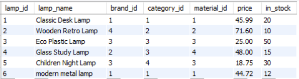
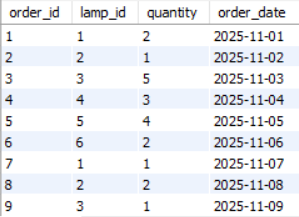
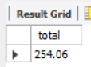

# TASK 5.2 РАЗРАБОТКА ХРАНИМОЙ ПРОЦЕДУРЫ И ФУНКЦИИ С КУРСОРОМ
## Исходная таблица ламп

## Исходная таблица заказов


## Процедура
```SQL
-- назначение: обновляет остатки лампы на складе, уменьшая количество на основе заказов
-- параметры: in p_lamp_id int
-- возвращает: ничего, но изменяет колонку in_stock в таблице dse_lamp
-- особенности: использует курсор для обхода заказов по лампе
  
delimiter //
create procedure dse_update_stock(in p_lamp_id int)
begin
    declare v_qty int;
    declare done int default 0;
  
    declare cur cursor for
        select quantity from dse_order where lamp_id = p_lamp_id;
  
    declare continue handler for not found set done = 1;
  
    open cur;
    read_loop: loop
        fetch cur into v_qty;
        if done = 1 then
            leave read_loop;
        end if;
  
        update dse_lamp
        set in_stock = in_stock - v_qty
        where lamp_id = p_lamp_id;
    end loop;
    close cur;
end //
delimiter ;
  
-- тест
call dse_update_stock(1);
```


## Функция
```SQL
-- назначение: считает общую сумму цен всех ламп
-- параметры: нет
-- возвращает: decimal(10,2) – сумма цен
-- особенности: использует курсор для обхода всех ламп
  
delimiter //
create function dse_total_price()
returns decimal(10,2)
deterministic
begin
    declare v_price decimal(10,2);
    declare v_total decimal(10,2) default 0.00;
    declare done int default 0;
  
    declare cur cursor for
        select price from dse_lamp;
  
    declare continue handler for not found set done = 1;
  
    open cur;
    read_loop: loop
        fetch cur into v_price;
        if done = 1 then
            leave read_loop;
        end if;
  
        set v_total = v_total + v_price;
    end loop;
    close cur;
  
    return v_total;
end //
delimiter ;
  
-- тест
select dse_total_price() as 'total';
```
